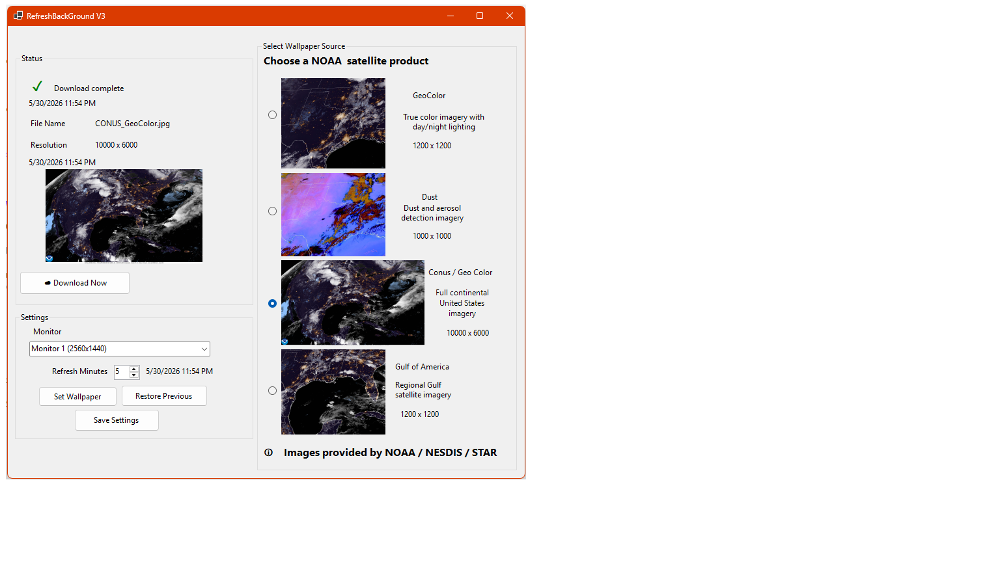

# RefreshBackGround

RefreshBackGround is a Windows desktop wallpaper manager that downloads live NOAA satellite imagery and applies it as a desktop background.

## Features

- Download NOAA satellite imagery
- Choose from multiple satellite products:
  - CONUS / GeoColor
  - GeoColor
  - Dust
  - Gulf of America
- Preview each wallpaper source
- Set the selected image as the desktop wallpaper
- Select monitor for wallpaper placement
- Restore previous wallpaper
- Auto-refresh on a timed interval
- Save basic settings
- NOAA / NESDIS / STAR image attribution

## Built With

- C#
- .NET
- Windows Forms
- NOAA / NESDIS / STAR satellite imagery

## Current Status

RefreshBackGround V3 is currently in active development. The main app shell, NOAA source gallery, download workflow, monitor selection, and wallpaper setting features are working.

## Planned Features

- System tray support
- Start with Windows
- Weather intelligence dashboard
- Next refresh countdown
- Improved source cards
- Additional NOAA image products

## Screenshot

## NOAA Image Sources
Images provided by:

NOAA / NESDIS / STAR

Satellite imagery remains the property of NOAA and is used in accordance with NOAA public access policies.

## Author

Maricia Alleman
Computer Scientist • Data Analytics Leader • Army Veteran • Software Developer

🌐 Portfolio: maricia.com

💼 LinkedIn: mariciaalleman

🐙 GitHub: maricia
